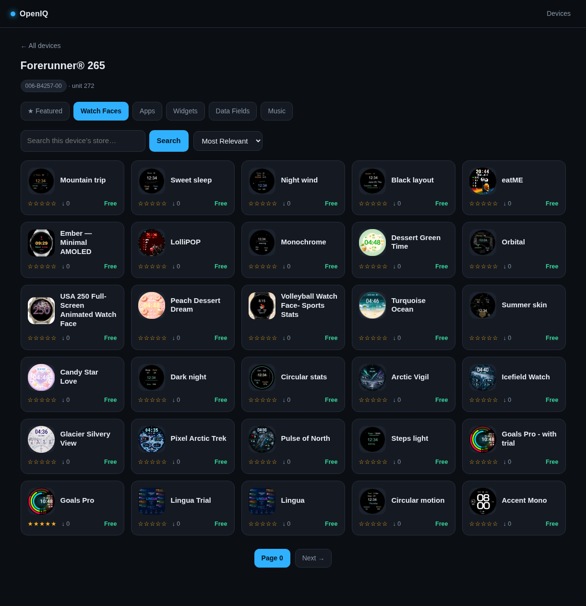

# OpenIQ — Connect IQ store in your browser

> Browse Garmin **watch faces, apps, widgets, and data fields** by device model from any web browser. A lightweight, self-hostable replacement for the discontinued Connect IQ store website.

[](https://deploy.workers.cloudflare.com/?url=https://github.com/klppl/OpenIQ)



---

## ⚡ Deploy to Cloudflare Workers (Free)

Run your own private instance on Cloudflare's free tier (100k requests/day, zero server maintenance).

### 1. One-Click Deploy or CLI

Click the **Deploy to Cloudflare** button above, or deploy manually using Wrangler:

```bash
# Clone and install dependencies
git clone https://github.com/klppl/OpenIQ.git && cd OpenIQ
npm install

# Set your secrets
npx wrangler secret put GARMIN_CIQ_CONSUMER_KEY
npx wrangler secret put GARMIN_CIQ_CONSUMER_SECRET
npx wrangler secret put GARMIN_EMAIL
npx wrangler secret put GARMIN_PASSWORD

# Deploy
npx wrangler deploy
```

---

## 🔑 Required Configuration

OpenIQ signs store requests using Garmin's Connect IQ OAuth1 consumer credentials. These are extracted once from the official Android app (`.apkm` / `.xapk`):

```bash
# 1. Unzip the APK bundle and extract libsr.so (arm64):
unzip -o 'config.arm64_v8a.apk' lib/arm64-v8a/libsr.so

# 2. Extract consumer key & secret:
strings lib/arm64-v8a/libsr.so | grep -A2 CIQ_APPSTORE_MOBILE
```

> 💡 **Tip:** You can also search for `CIQ_APPSTORE_MOBILE` on GitHub code search to find a working key pair.

### Environment / Secret Variables

| Variable | Description | Required |
|---|---|---|
| `GARMIN_CIQ_CONSUMER_KEY` | Connect IQ OAuth1 Consumer Key (from `libsr.so`) | **Yes** |
| `GARMIN_CIQ_CONSUMER_SECRET` | Connect IQ OAuth1 Consumer Secret (from `libsr.so`) | **Yes** |
| `GARMIN_EMAIL` | Garmin Connect account email (headless login) | Optional (for auto-login) |
| `GARMIN_PASSWORD` | Garmin Connect account password | Optional (for auto-login) |

---

## 🐳 Alternative: Self-Host via Docker / Local

If you prefer running OpenIQ on your own VPS or local machine:

### Docker Compose

```bash
# 1. Create secrets.env
cat > secrets.env <<EOF
GARMIN_CIQ_CONSUMER_KEY=your_key
GARMIN_CIQ_CONSUMER_SECRET=your_secret
GARMIN_EMAIL=your_email@example.com
GARMIN_PASSWORD=your_password
EOF
chmod 600 secrets.env

# 2. Start container
docker compose up -d
```
Access at `http://localhost:8087`.

### Local Go

```bash
cp secrets.env.example secrets.env   # fill in credentials
go run .                             # opens on http://localhost:8087
```

---

## 🛠️ How It Works

1. **SSO Authentication**: Performs Garmin SSO login via OAuth1 ticket exchange.
2. **Consumer Re-minting**: Exchanges the login token for a Connect-IQ-scoped token.
3. **Signed Store Requests**: Signs requests to `services.garmin.com/appstore/api` using HMAC-SHA1 and passes model part numbers (`X-Garmin-SW-Part-Number`) to retrieve compatible watch faces, widgets, and apps.
4. **Edge Caching**: Responses are cached with standard HTTP `Cache-Control` headers so repeat views hit the CDN edge rather than Garmin's servers.

---

## ⚖️ Disclaimer

Unofficial tool for personal use. Not affiliated with or endorsed by Garmin. Please use a dedicated account and do not commit or redistribute private credentials.
